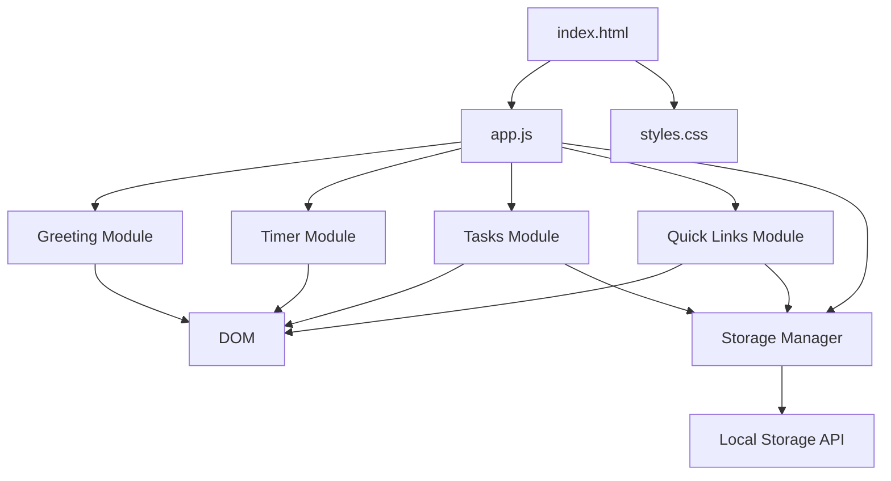
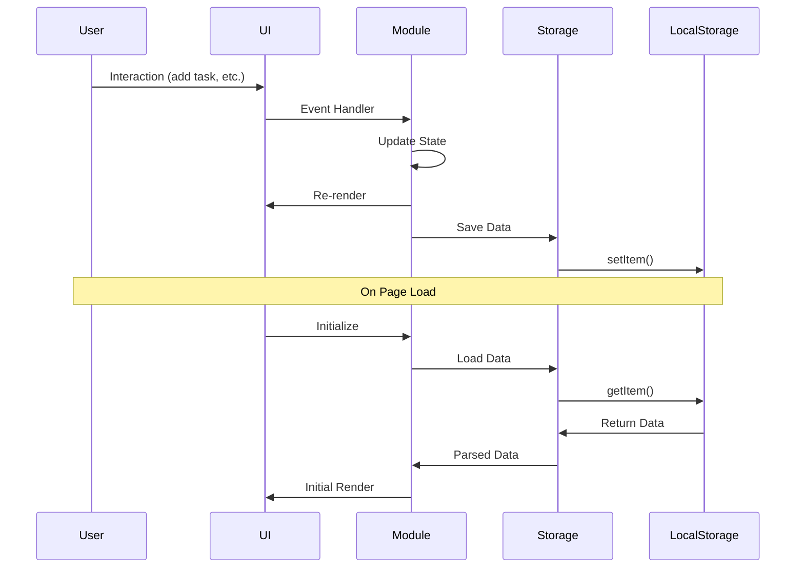

# Design Document: Productivity Dashboard

## Overview

The Productivity Dashboard is a client-side web application that provides essential productivity tools in a single, clean interface. The application consists of four main components: a greeting display with real-time clock, a 25-minute focus timer, a to-do list manager, and a quick links panel. All data is persisted using the browser's Local Storage API, ensuring user data survives page refreshes without requiring a backend server.

The application is built using vanilla JavaScript, HTML, and CSS, adhering to strict constraints of single-file organization for both CSS and JavaScript. This design emphasizes simplicity, performance, and maintainability while providing a responsive and intuitive user experience.

### Key Design Goals

- **Zero Dependencies**: Pure vanilla JavaScript with no frameworks or libraries
- **Client-Side Only**: All functionality runs in the browser with Local Storage persistence
- **Single Responsibility**: Each component manages its own state and DOM interactions
- **Performance**: Minimal DOM manipulation and efficient event handling
- **Maintainability**: Clear separation of concerns despite single-file constraints

## Architecture

### High-Level Architecture

The application follows a component-based architecture within the constraints of vanilla JavaScript. Each major feature (Greeting, Timer, Tasks, Quick Links) is encapsulated as a module with its own initialization, state management, and rendering logic.



### Module Structure

The single JavaScript file (app.js) will be organized into logical modules using the Revealing Module Pattern:

1. **Storage Manager**: Centralized interface for Local Storage operations
2. **Greeting Module**: Manages time/date display and greeting logic
3. **Timer Module**: Handles countdown timer state and controls
4. **Tasks Module**: Manages task CRUD operations and persistence
5. **Quick Links Module**: Manages link CRUD operations and persistence
6. **App Initializer**: Coordinates module initialization on page load

### Data Flow



## Components and Interfaces

### 1. Storage Manager

**Responsibility**: Provide a consistent interface for reading and writing data to Local Storage with error handling.

**Public Interface**:
```javascript
StorageManager = {
  save(key, data),      // Serialize and save data
  load(key),            // Load and parse data
  remove(key)           // Remove data by key
}
```

**Implementation Details**:
- Handles JSON serialization/deserialization
- Provides error handling for quota exceeded and parse errors
- Returns null for missing keys instead of throwing errors

### 2. Greeting Module

**Responsibility**: Display current time, date, and time-appropriate greeting with automatic updates.

**Public Interface**:
```javascript
GreetingModule = {
  init(containerElement)  // Initialize and start clock
}
```

**Internal State**:
- `intervalId`: Reference to setInterval for cleanup
- `containerElement`: DOM reference for updates

**Implementation Details**:
- Uses `setInterval` with 1000ms delay for clock updates
- Determines greeting based on current hour (5-11: morning, 12-16: afternoon, 17-4: evening)
- Formats time using `toLocaleTimeString()` and date using `toLocaleDateString()`
- Updates DOM directly without full re-render for performance

### 3. Timer Module

**Responsibility**: Manage 25-minute countdown timer with start, stop, and reset controls.

**Public Interface**:
```javascript
TimerModule = {
  init(containerElement)  // Initialize timer UI and state
}
```

**Internal State**:
```javascript
{
  totalSeconds: 1500,        // 25 minutes in seconds
  remainingSeconds: 1500,    // Current countdown value
  isRunning: false,          // Timer state
  intervalId: null           // Reference to setInterval
}
```

**Implementation Details**:
- Countdown logic decrements `remainingSeconds` every second
- Stops automatically when reaching zero
- Formats display as MM:SS using zero-padding
- Event listeners on start/stop/reset buttons update state and UI
- Uses `setInterval` for countdown, cleared on stop/reset

### 4. Tasks Module

**Responsibility**: Manage to-do list with add, edit, mark done, delete operations and Local Storage persistence.

**Public Interface**:
```javascript
TasksModule = {
  init(containerElement)  // Initialize tasks UI and load data
}
```

**Internal State**:
```javascript
{
  tasks: [                  // Array of task objects
    {
      id: "uuid",           // Unique identifier
      text: "Task text",    // Task description
      completed: false,     // Completion status
      createdAt: timestamp  // Creation timestamp
    }
  ]
}
```

**Implementation Details**:
- Generates unique IDs using timestamp + random number
- Maintains task order by creation time
- Inline editing: double-click task to edit, blur/enter to save
- Renders complete list on each state change (acceptable for small lists)
- Saves to Local Storage after every modification
- Loads from Local Storage on initialization
- Empty state message when no tasks exist

**Storage Key**: `"productivity-dashboard-tasks"`

### 5. Quick Links Module

**Responsibility**: Manage quick links with add, delete operations and Local Storage persistence.

**Public Interface**:
```javascript
QuickLinksModule = {
  init(containerElement)  // Initialize links UI and load data
}
```

**Internal State**:
```javascript
{
  links: [                  // Array of link objects
    {
      id: "uuid",           // Unique identifier
      name: "Link name",    // Display text
      url: "https://...",   // Target URL
      createdAt: timestamp  // Creation timestamp
    }
  ]
}
```

**Implementation Details**:
- Validates URL format before adding (must start with http:// or https://)
- Opens links in new tab using `target="_blank"` with `rel="noopener noreferrer"` for security
- Generates unique IDs using timestamp + random number
- Renders complete list on each state change
- Saves to Local Storage after every modification
- Loads from Local Storage on initialization
- Empty state message when no links exist

**Storage Key**: `"productivity-dashboard-links"`

### 6. App Initializer

**Responsibility**: Coordinate initialization of all modules when DOM is ready.

**Public Interface**:
```javascript
App = {
  init()  // Initialize all modules
}
```

**Implementation Details**:
- Waits for `DOMContentLoaded` event
- Queries DOM for container elements
- Calls `init()` on each module with appropriate container
- Handles initialization errors gracefully

## Data Models

### Task Model

```javascript
{
  id: String,           // Unique identifier (timestamp + random)
  text: String,         // Task description (1-500 characters)
  completed: Boolean,   // Completion status
  createdAt: Number     // Unix timestamp in milliseconds
}
```

**Validation Rules**:
- `id`: Required, must be unique
- `text`: Required, non-empty after trimming, max 500 characters
- `completed`: Required, boolean
- `createdAt`: Required, positive number

**Storage Format**: JSON array in Local Storage under key `"productivity-dashboard-tasks"`

### Link Model

```javascript
{
  id: String,           // Unique identifier (timestamp + random)
  name: String,         // Display name (1-50 characters)
  url: String,          // Valid URL starting with http:// or https://
  createdAt: Number     // Unix timestamp in milliseconds
}
```

**Validation Rules**:
- `id`: Required, must be unique
- `name`: Required, non-empty after trimming, max 50 characters
- `url`: Required, must match pattern `^https?://`
- `createdAt`: Required, positive number

**Storage Format**: JSON array in Local Storage under key `"productivity-dashboard-links"`

### Timer State Model

```javascript
{
  totalSeconds: 1500,        // Constant: 25 minutes
  remainingSeconds: Number,  // 0 to 1500
  isRunning: Boolean         // Timer state
}
```

**Note**: Timer state is NOT persisted to Local Storage. It resets to initial state on page load.


## Correctness Properties

A property is a characteristic or behavior that should hold true across all valid executions of a system—essentially, a formal statement about what the system should do. Properties serve as the bridge between human-readable specifications and machine-verifiable correctness guarantees.

### Property 1: Greeting matches time of day

For any hour of the day (0-23), the greeting function should return "Good morning" for hours 5-11, "Good afternoon" for hours 12-16, and "Good evening" for hours 17-4.

**Validates: Requirements 1.3, 1.4, 1.5**

### Property 2: Timer reset restores initial state

For any timer state (any remaining seconds value, running or stopped), calling reset should return the timer to 1500 seconds and stopped state.

**Validates: Requirements 2.5**

### Property 3: Timer format displays MM:SS correctly

For any number of seconds from 0 to 1500, the format function should return a string in MM:SS format with zero-padding (e.g., 0 → "00:00", 90 → "01:30", 1500 → "25:00").

**Validates: Requirements 2.7**

### Property 4: Adding task increases list size

For any task list and any valid task text (non-empty after trimming), adding the task should increase the list length by exactly one.

**Validates: Requirements 3.1**

### Property 5: Tasks maintain creation order

For any sequence of task additions, the task list should maintain the order in which tasks were created, with earlier tasks appearing before later tasks.

**Validates: Requirements 3.2**

### Property 6: Editing task preserves identity

For any task in the list and any new valid text, editing the task should update its text property while preserving its id, completed status, and createdAt timestamp.

**Validates: Requirements 3.3**

### Property 7: Marking task as done updates status

For any task in the list, marking it as done should set its completed property to true, and marking it as not done should set it to false.

**Validates: Requirements 3.4**

### Property 8: Deleting task removes it from list

For any task in the list, deleting that task should reduce the list length by exactly one and the task should no longer be findable by its id.

**Validates: Requirements 3.5**

### Property 9: Task modifications persist to storage

For any task list modification operation (add, edit, mark done, delete), the data retrieved from Local Storage immediately after the operation should match the current in-memory state.

**Validates: Requirements 3.6, 4.1, 4.2, 4.3, 4.4**

### Property 10: Task storage round-trip preserves data

For any valid task list, saving it to Local Storage and then loading it back should produce an equivalent task list with all tasks having the same id, text, completed status, and createdAt values.

**Validates: Requirements 3.7, 4.5**

### Property 11: Adding link increases list size

For any link list and any valid link data (non-empty name and valid URL), adding the link should increase the list length by exactly one.

**Validates: Requirements 5.1**

### Property 12: All links appear in rendered output

For any link list, the rendered HTML should contain a clickable element for each link with the correct name and URL.

**Validates: Requirements 5.2**

### Property 13: Deleting link removes it from list

For any link in the list, deleting that link should reduce the list length by exactly one and the link should no longer be findable by its id.

**Validates: Requirements 5.4**

### Property 14: Link modifications persist to storage

For any link list modification operation (add, delete), the data retrieved from Local Storage immediately after the operation should match the current in-memory state.

**Validates: Requirements 5.5, 6.1, 6.2**

### Property 15: Link storage round-trip preserves data

For any valid link list, saving it to Local Storage and then loading it back should produce an equivalent link list with all links having the same id, name, url, and createdAt values.

**Validates: Requirements 5.6, 6.3**

## Error Handling

### Local Storage Errors

**Quota Exceeded**:
- Scenario: User's Local Storage is full
- Handling: Catch `QuotaExceededError`, display user-friendly message, prevent data loss by keeping in-memory state
- User Action: Clear browser data or remove old tasks/links

**Parse Errors**:
- Scenario: Corrupted data in Local Storage
- Handling: Catch `JSON.parse()` errors, log to console, initialize with empty state
- User Action: Data is reset, user starts fresh

**Access Denied**:
- Scenario: Browser privacy settings block Local Storage
- Handling: Detect unavailable Local Storage, display warning message, continue with in-memory only mode
- User Action: Adjust browser settings or accept session-only data

### Input Validation Errors

**Invalid Task Text**:
- Scenario: Empty or whitespace-only task text
- Handling: Prevent task creation, show validation message, keep input focused
- User Action: Enter valid text

**Invalid URL**:
- Scenario: Link URL doesn't start with http:// or https://
- Handling: Prevent link creation, show validation message with example
- User Action: Enter valid URL with protocol

**Excessive Length**:
- Scenario: Task text exceeds 500 characters or link name exceeds 50 characters
- Handling: Truncate input or show character counter with warning
- User Action: Shorten text

### Timer Edge Cases

**Timer at Zero**:
- Scenario: Timer reaches 0:00
- Handling: Stop countdown automatically, keep at 0:00 until reset
- User Action: Reset timer to start again

**Rapid Button Clicks**:
- Scenario: User clicks start/stop/reset rapidly
- Handling: Debounce or disable buttons during state transitions
- User Action: Wait for current operation to complete

## Testing Strategy

### Overview

The testing strategy employs a dual approach combining unit tests for specific examples and edge cases with property-based tests for universal correctness guarantees. This ensures both concrete behavior validation and comprehensive input coverage.

### Unit Testing

Unit tests will focus on:

1. **Specific Examples**:
   - Greeting displays "Good morning" at 9:00 AM
   - Timer initializes to 25:00
   - Empty task list shows empty state message
   - Empty links list shows empty state message

2. **Edge Cases**:
   - Timer at zero stops counting
   - Empty Local Storage initializes empty lists
   - Whitespace-only task text is rejected
   - URL without protocol is rejected

3. **Error Conditions**:
   - Local Storage quota exceeded handling
   - JSON parse errors from corrupted data
   - Invalid input validation

4. **Integration Points**:
   - Storage Manager correctly serializes/deserializes data
   - Module initialization sequence
   - DOM event handler wiring

**Testing Framework**: Use a lightweight testing framework like Jest or Mocha with JSDOM for DOM manipulation testing.

**Test Organization**: Group tests by module (Greeting, Timer, Tasks, Quick Links, Storage Manager).

### Property-Based Testing

Property-based tests will verify universal properties across randomized inputs using a property-based testing library.

**Library Selection**: Use `fast-check` for JavaScript property-based testing.

**Configuration**: Each property test should run a minimum of 100 iterations to ensure comprehensive input coverage.

**Test Tagging**: Each property test must include a comment referencing the design document property:

```javascript
// Feature: productivity-dashboard, Property 1: Greeting matches time of day
```

**Properties to Test**:

1. **Property 1**: For random hours (0-23), verify greeting correctness
2. **Property 2**: For random timer states, verify reset returns to 1500
3. **Property 3**: For random seconds (0-1500), verify MM:SS format
4. **Property 4**: For random valid task text, verify list grows by one
5. **Property 5**: For random task sequences, verify creation order maintained
6. **Property 6**: For random tasks and new text, verify edit preserves identity
7. **Property 7**: For random tasks, verify marking done updates status
8. **Property 8**: For random tasks, verify deletion reduces list by one
9. **Property 9**: For random task operations, verify persistence to storage
10. **Property 10**: For random task lists, verify storage round-trip
11. **Property 11**: For random valid link data, verify list grows by one
12. **Property 12**: For random link lists, verify all appear in render
13. **Property 13**: For random links, verify deletion reduces list by one
14. **Property 14**: For random link operations, verify persistence to storage
15. **Property 15**: For random link lists, verify storage round-trip

**Generators**: Create custom generators for:
- Valid task text (non-empty strings, 1-500 chars)
- Valid link data (name 1-50 chars, URL with http/https)
- Task lists (arrays of task objects)
- Link lists (arrays of link objects)
- Timer states (seconds 0-1500, running boolean)
- Hours (integers 0-23)

### Test Coverage Goals

- **Line Coverage**: Minimum 80% of JavaScript code
- **Branch Coverage**: Minimum 75% of conditional branches
- **Function Coverage**: 100% of public module functions

### Manual Testing

Manual testing required for:
- Visual design and layout across different screen sizes
- Browser compatibility (Chrome, Firefox, Edge, Safari)
- Performance and responsiveness perception
- Accessibility with keyboard navigation and screen readers

### Continuous Testing

- Run unit tests on every code change
- Run property-based tests before commits
- Use browser automation (Playwright/Puppeteer) for integration tests
- Test in multiple browsers using BrowserStack or similar service

